#  Taxi Drivers Go Where? 

A time series prediction on the demand of taxi at New York City\
by __Tan__ Jun Pin
---
## Content

 - [Datasets Sources](#Datasets-Sources)
 - [Project Background](#Project-Background)
 - [Methodology](#Methodology)
 - [Data Cleaning](#Data-Cleaning)
 - [Findings From EDA](#Findings-From-EDA)
 - [Findings From Models](#Findings-From-Models)
 - [Conclusions & Recommendations](#Conclusions-&-Recommendations)
 
---

## Datasets Sources

All datasets were obtained from NYC.GOV with Taxi & Limousine Commission.
([source](https://www.nyc.gov/site/tlc/about/tlc-trip-record-data.page))

There are total of 2 types of datasets were downloaded which are:
* [`Yellow Taxi Trip Records (Jan' 22 to Aug' 22)`](./datasets/yellow_taxi_2022)
* [`Taxi Zoning and Map`](./datasets/taxi_zones)

Due to large file size, the datasets are stored in the link below for access:
([Google Drive](https://drive.google.com/drive/folders/1l0nUoy24r1OhhRIodX1p-E6-OJvNY098?usp=share_link))

## Project Background

Taxi services are very customer-centric. Everyone one of us could easily get a taxi ride these days. We could easily hail down any taxi on the streets or even with just few buttons away using applications. Taxi services provide us with much convenient of transporting us to any location (as long as the road connects!). As a passenger, once we reach our destination, the taxi will be empty and the driver is ready to 'hunt' for new passengers.

However, it is not easy to get a new passenger especially the taxi is not located at any popular location like business district, airport or shopping areas. Very often, taxi drivers are 'abandoned' at areas where they are not familiar or even far from the 'hotspot'. It is all known that a taxi has to keep on cruise on the road or at least driver towards the famous hotspot to get new passengers. 

Crusing on the road is time and fuel consuming which is not ideal for taxi drivers. Worst is when the driver is cruising on the wrong area where the area itself has no demand for taxi at that particular time. Demand for Taxi is not always constant throughout the day. Area like the business district could see more Pick Up in the evening as everyone is returning home while Airport on the other hand, could have a more constant pick up demand due to the passengers arriving to the airport. On the other hand, some areas like factory district or residential areas, the demand for taxi is simply not good throughout the day.

Hence, in this project, we would like to predict on the demand of Taxi focusing on the areas in New York City where taxi drivers could easily know the area they are located or going to go will have any demand for taxi. They could also know if the neighboring areas will have any demand for taxi.

## Methodology

This project is carried out based on the sequence here. Once the problem statements are identified, this project is carried out in the sequence below:

1. [Data Import](#Data-Import)
2. [Data Cleaning](#Data-Cleaning)
3. [Modeling](#Modeling)
4. [Deployment](#Deployment)
5. [Conclusion & Future Works](#Conclusion-and-Future-Work)

---

## Data Import
Files are downloaded and saved in local machine. The taxi rides datasets are stored in the format of `.parquet` format and shared on monthly basis. All the files are then downloaded and saved in a folder for reading in python [Yellow Taxi Dataset](./datasets/yellow_taxi_2022)

`glob` is used in reading the number of files in the folder. Soon after `read_parquet` is used to read the parquet files from the datasets and `concat` to be a single dataframe.

The new dataframe consists of over 26 millions rows and 19 columns with the dataframe size of 1.79GB. 

## Data Cleaning & Data Size Reduction
The datasets is huge and comes with big file size. To allow a faster execution time in running the code, both data cleaning and data size reduction are done.

### Data Size Reduction
For more efficient python programming, a smaller dataframe size is required. The unwanted columns and the data types for each remaining columns of the dataframe are transformed to dataset with lower size. For instance:
|Column Feature|Original Data Type|New Data Type|Remark|
|---|:---:|:---:|---|
|tpep_pickup_datetime | datetime64[ns]|datetime64[ns]| Remained 
|tpep_dropoff_datetime| datetime64[ns]|datetime64[ns]| Remained
|trip_distance        | float64|float 32|
|PULocationID         | int64| category|
|DOLocationID         | int64|category|
|fare_amoun           | float64| float32|
|extra                | float64|float16|
|tip_amount           | float64|float16|
|total_amount         | float64|float32|

The conversion of datasets had reduced the data size to 0.89MB or 50% in reduction from original data size.

### Data Cleaning
The following feature criterions are executed while cleaning the dataset:
- Remove dates that are not within the year 2022 for both tpep_pickup_datetime and tpep_dropoff_datetime
- Remove rows where the tpep_pickup_datetime and tpep_dropoff_datetime are the same
- Remove rows where the fare_amount is 0
- Remove rows where trip_distant is 0
- Remove rows with unknown zones (zone 264 and 265)
- Remove rows with unrealistic duration and trip distant:
:- Obtain duration of trip from both pickup and dropoff datetime
:- Obtain speed of traveling from the trip_distant and duration
:- Remove rows where speed limit is over 80 miles/hr. (The speed limit in New York City is only 55 miles/hr)

After doing the data cleaning, all other features that were used mainly for data cleaning are removed. Only the following features are kept:
* tpep_pickup_datetime
* tpep_dropoff_datetime
* PULocationID
* DOLocationID

With the effort of data cleaning, the number of rows are reduced as follows:
|Original Row No.|Current Row No.|Reduction|
|---|---|---|
|26,144,654|25,348,245| -3% |

With this datasets that are saved for further usage, the sizes reduction are:
|Item|Size|
|---|---|
|Original Data Size| 1795 MB|
|Optimized Data Size| 897 MB| 
|Cleaned & Optimized Data Size|483 MB|
|Size Reduction|73.1%|

## Explodatory Data Analysis
The taxi trip dataset obtained mainly consists of the pickup and droppoff datetime from the pickup Location ID and dropoff location ID. Those locations are scattered around New York City which are split to 6 borough and 263 zones. 
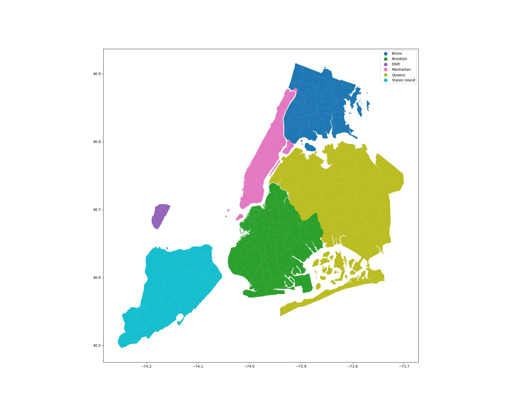\
It is worth highlighting that Borugh EDW which consists of only 1 zone which is Newark Airport is not located at New York State but New Jersey. Due to the close proximity of the airport to New York city, there were many rides made between Newark Airport and the other zones in the other 5 boroughs.

In total, there were over 25 millions rides made within New York City from January to August 2022. Hence, to check if the frequency of the taxi ride is seasonal or just random, a 5 minutes interval group of seasonal decompose charts are plotted.
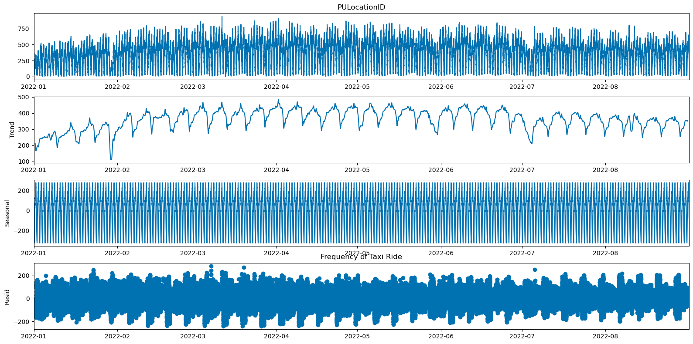\
Based on the charts above, we have the following inference: 
**Trend**
With the Period of 1 day or 24 hours, we could see a very strong trend from the dataset. It is obvious that the dataset has weekly trend line where we could see a cyclical trend on every 7 days. It is noticable that there are some outliers which are on the date:
29 Jan - No special event. This data could be missing due to technical issue
29 May - Memorial Day
04 July - National Day
10 August - No special event. This data could be missing due to technical issue

**Seasonal**
We could see that there is definitely seasonality in the data and the fluctuate is approximately 300 over the day.

**Residual**
Residuals are consistent and range around 200 from zero values.

With this in mind, since there is a clear daily trend in the trend chart, a boxplot of the frequency 

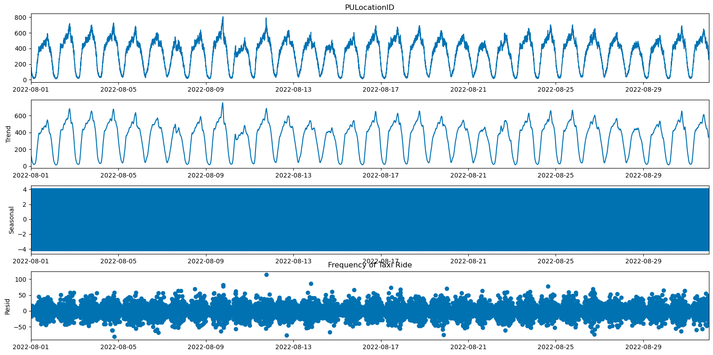\
**Trend**
With the Period of 1 hour or 60 Minutes, we could see a very strong trend from the dataset. It is obvious that the dataset has daily trend line as well where we could see a cyclical trend on every day.

**Seasonal**
We could see that there is definitely seasonality in the data and the fluctuate is approximately 4 over the day.

**Residual**
Residuals are consistent and range around 50 from zero values.

Since the trend charts above shows a day trend, a box-plot is plotted on the frequrncy of the hourly interval dataset.
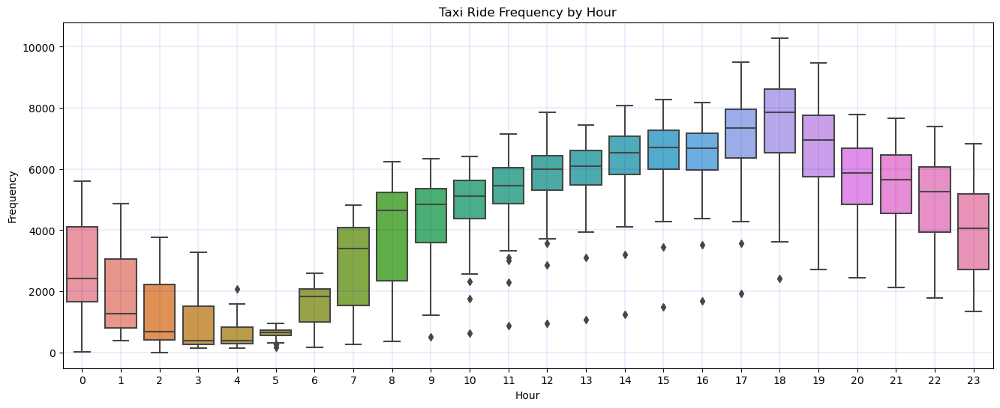
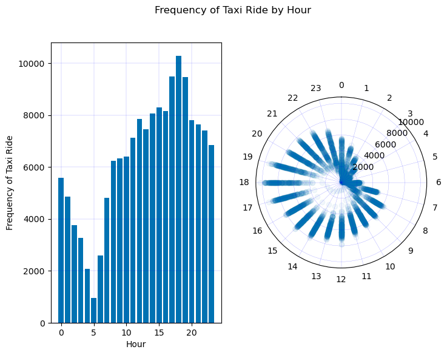\
With the boxplot, bar chart and the polar charts, it is clear that we could see a very strong daily trend on the frequency of taxi rides. The taxi ride frequencies slowly increase from 5AM in the morning and peak at 6PM and slowly decrease again to 5AM.

It is worth higlighted that the highest peak of taxi rides happens at 6PM and the the lowest peak occured at 5AM. This trend shows that taxi ride frequency happens more often during the day and espcially 6PM where it is the end of the business day.

## Feature Engineering
As we know that there are many taxis around new york city. In the same time frame, there could be picking up and dropping off at the zone. This decreases the chance of a new taxi that wishes to come into the zone and pick up passengers as within the zone itself, there are already available taxi to pick up new passengers and they are nearer! 

To obtain the actual demand of taxi, a new feature `demand` is created by substracting the Pick Up frequemcy with the Drop Off frequency. Positive value simply imply that there are more picking up than dropping off which could be good for nearby taxi who wishes to enter the zone for new passenger. Negative value shows that there are more dropping off than picking up. The area is saturated with readily available taxi for new passenger to hail down.

As a whole New York City, the number of picking up and dropping off is the same as taxis are travelling from zone to zone but still within new york city.

However, if we look at specify zone, we could see a very different in demand trend.
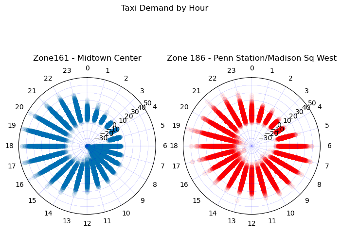\
Between Zone 161 - Midtown Center and Zone 186 Penn Station/Madison Sq West where both are located in Manhattan Borough, we could see the demand is different. 

Midtown Manhattan is home to iconic attractions. At tourist area, eventually more dropping off will happen in the morning and the demand slowly turns higher throughout the day. This is a tourist travelling behaviour where they visit the place in the morning and will leave the area in the afternoon or evening.

Pennsylvania Station, also known as Penn Station, is the main intercity railroad station in New York City. Despite located at Manhattan Borough, same like Midtown Manhattan, the pick up demand beigns at 0500 and lasted thoughout the day untill 0000 the next day. This could be due to the train arrival timing and sicne Penn Station is one of the busiest station, the train arriving could be plenty.

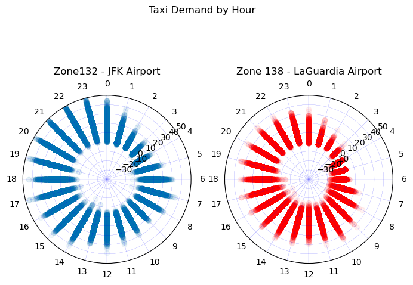\
Another example is comparison between Zone 132 - JFK Airport and Zone 138 - LaGuardia Airport which both are located in same Queens Borough and being the same air hub, we still could see the difference in demand for passengers.

Similarly, we could also see patterns of the demand of taxi in this time series.

## Modeling Strategy
6 methods of modeling strategy is deployed here to train and test on the dataset. The model that were used here are:/
1. Theta Method**
-- The trained time series is de-seasonalized according to seasonality_period
2. NaiveDrift Model
-- This model fits a line between the first and last point of the training series and extends the line when continuing the fitting.
3. Naive Seasonal Model
-- The model predicst the value of K time steps ago. 
-- K is the seasonality part of the data where the model predicts the last K steps of the training set. 
-- When K = 1, the model predicts the last value of the training set. 
-- When K> 1, it repeats the last K values of the training set
4. Croston Model
-- The model is specifically designed to forecast time series with intermittent demand.
5. Exponential Smoothing
-- Wrap around statsmodels Holt-Winters' Exponential Smoothing method in which the method uses exponential smoothing to encode the values from the past for prediction on seasonality values for the present and future.
6. Random Forest
-- Using random forest regression, it uses some of the target series' lags to oobtain forecast

With limited resources, one zone from each borough will be used to train and test on the model performance. The zones being deployed for trainigs and testings are:
|Borough|Zone|LocationID|
|---|---|---|
|Queens|LaGuardia Airport|138|
|Bronx|Mott Haven/Port Morris|168|
|Brooklyn|Cypress Hills|63|
|EWR|Newark Airport|1|
|Manhattan|Upper East Side South|237|
|Staten Island|Bloomfield/Emerson Hill|23|

## Evaluation Metrics
There are many metrices which are suitable for timeseries prediction which are:
- Mean absolute percentage error (MAPE)
- Mean absolute error (MAE)
- Mean squared error (MSE)
- Root mean squared error (RMSE)
- Mean absolute scaled error (MASE)

However, for this project, we have negative integers and zeros. Hence, metrices that utilized division of original datasets will not be suitable as the value will be very big or close to infinitly. 

To obtain the `MAPE` the datasets are added with a constants to neutralize the impact of negative values. The constant value is deduced from the (minimum values of the dataset + 1). This could lead to all the value to be at least 1 and above. 

Upon completion of prediction with the arbitrary values, `MAPE` is then identified. The predicted value is then substracting off the constant value that were added prior prediction. From here, the `MAE` and actual prediction values are returned and showed.

`MAE` takes the average of absolute errors for a group of predictions and observations as a measurement of the magnitude of errors for the entire group. The value starts from 0 and is indifferent to the direction of errors. This could be good for our values with negative intergers.

For both metrices, the lower the value, the better the model performance. 

Lastly, `MAE` will be used for interpretation.

Due to the number of datasets and zones, `execution_time` during training and test will also be considered. 

## Findings From Models
Referring to the charts below on the performance for all 6 models on all zones frome each borough.
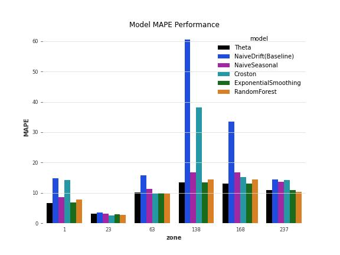
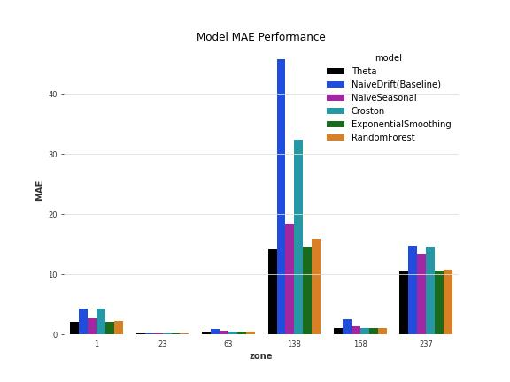\
Generally, the models that are performing which has lower MAPE are:
- Theta
- Exponential Smoothing
- Random Forest

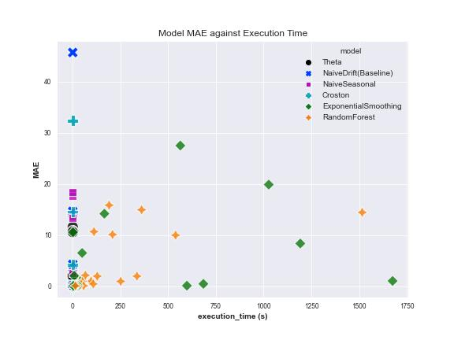\
We could see a very significant longer executive time is required for both Exponential Smoothing and Random Forest model. With the limited computational power, it is decided to proceed with Theta Model for further training and deployment.

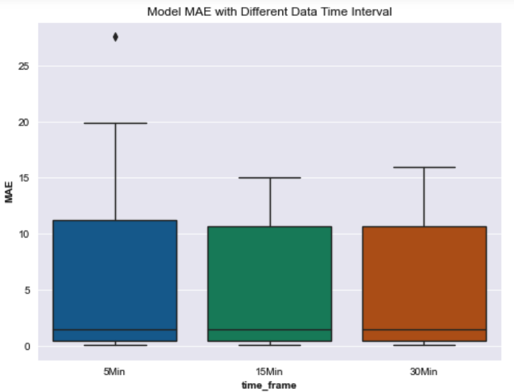\
From the Box Plot above, the MAE is relatively similar across 3 periods. The average MAE is also closed with the rest. Since it has smaller gap of error, 15Mins timeframe is selected for deployment as it has relatively smaller MAE than the other time period.

As a conclusion, the conditions that are selected for further training and development are as follows:
- Model: Theta Model
- Time Frame: 15 Mins Interval

## Deployment
### Landing Page & Selection of Borough & Area
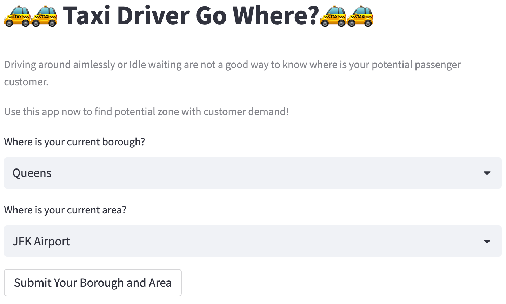

### Driver is in the High Demand Area

### Driver is in area where neighboring areas are having demand

### Driver is in area where neighboring areas are not in taxi demand.
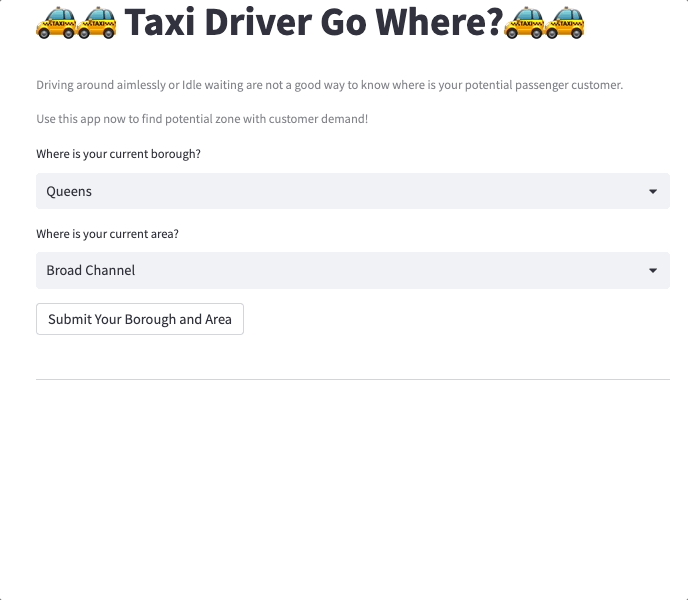

## Conclusions And Recommendations
Prediction on demand for all the zones are successfully executed. However, the prediction is not too accurate as we could see some zones are always having low demand or no demand at all. As this is solely coming from Yellow Taxi, there are other taxi operators in New York City like Green Taxi and even UBER and Lyft. 

For future works in improving this project, the following stpes below are suggested:
1. To incorporate all the datasets from all taxi operators where a larger and stronger computational capacity machine is required
2. To deploy the steamlit application to cloud
3. To include the feature of detecting the driver's coordinate via the app.
4. To deploy the Altair interactive map to streamlit like the GIF below:
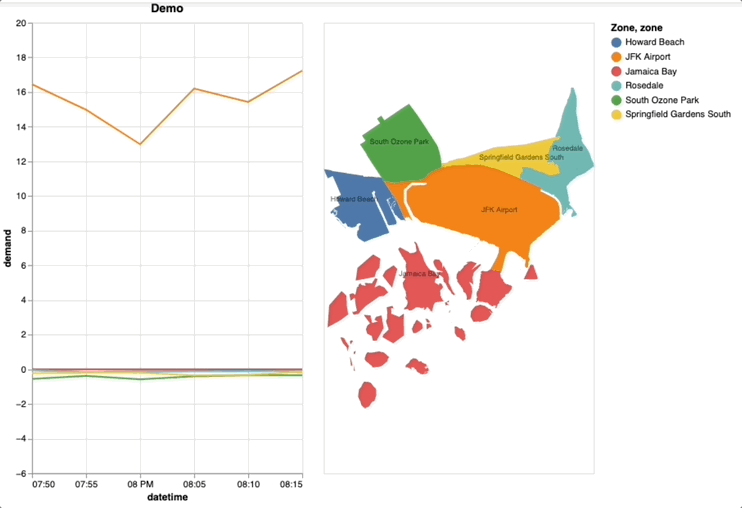